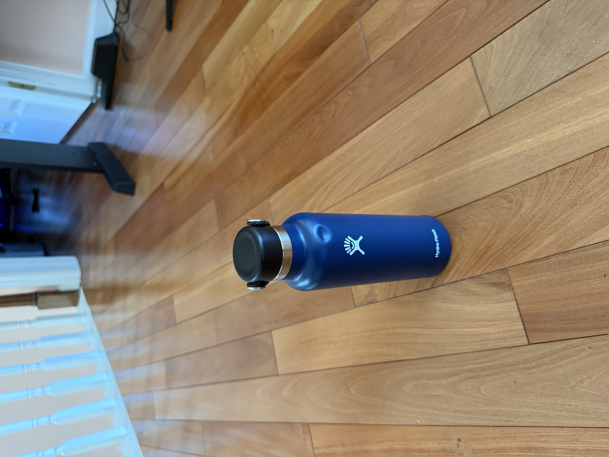
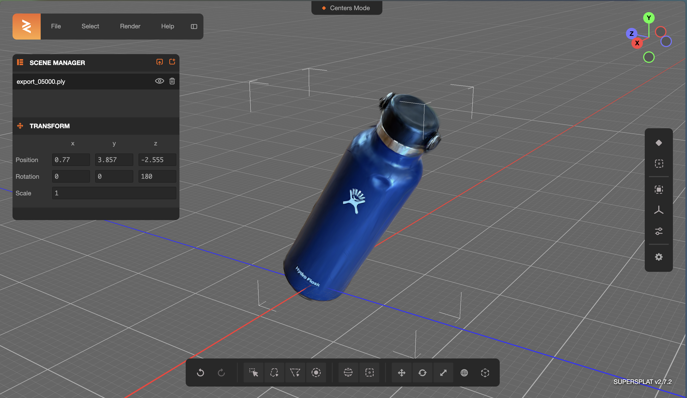

# Torque

**Transform 2D captures into interactive 3D assets using Gaussian Splatting**

Torque converts multi-view images into high-quality 3D models. Capture objects from multiple angles, define boundaries with AI-powered masking, and generate photorealistic 3D assets with clean backgrounds for games, AR, and digital content.

<table>
<tr>
<td width="50%">

<p align="center"><em>Input: Multi-view 2D captures</em></p>
</td>
<td width="50%">

<p align="center"><em>Output: Interactive 3D asset</em></p>
</td>
</tr>
</table>

## Architecture

- **Frontend**: Next.js 13 with React Three Fiber for 3D visualization
- **Backend**: FastAPI for video processing pipeline
- **Processing**: AWS EC2 instances running SAM2 → COLMAP → Gaussian Splatting pipeline
- **Storage**: S3 buckets for asset management

## Key Features

- **Multi-View Capture**: Upload image sequences from different angles
- **AI-Powered Masking**: SAM2 (Segment Anything Model 2) for precise object segmentation  
- **Interactive Brush Tools**: Fine-tune object boundaries with intuitive masking interface
- **3D Asset Generation**: COLMAP structure-from-motion + Gaussian Splatting
- **Clean Asset Export**: RGBA generation with transparent backgrounds for production use
- **Real-time Preview**: Interactive 3D viewer with orbit controls and lighting
- **Cost-Effective Processing**: Smart EC2 scaling ($6-10/month vs $380/month 24/7)
- **High Performance**: C++ optimizations with OpenMP + SIMD vectorization (6.2x speedup)

## File Structure

### Frontend (Next.js)
```
app/                    # Next.js 13 app router pages
components/            # Reusable UI components
contexts/             # React context providers
public/               # Static assets
```

### Backend (FastAPI)
```
api/                  # FastAPI server and endpoints
backend/awsFunctions/ # EC2 processing scripts
  ├── init_job.py          # Initial job setup and preview generation
  ├── refine_mask.py       # Mask refinement based on user brush input
  ├── run_sam2.py          # SAM2 video processing and RGBA generation
  └── sam2_service.py      # SAM2 service wrapper
```

### Configuration
```
requirements.txt      # Python dependencies
package.json         # Node.js dependencies
vercel.json          # Deployment configuration
```

## Processing Pipeline

1. **Upload**: Users upload image sequences through the web interface
2. **Interactive Masking**: Users define object boundaries using SAM2-powered brush tools
3. **Segmentation**: Segment Anything Model 2 creates precise object masks
4. **RGBA Generation**: Transparent background images are created using segmentation masks
5. **COLMAP**: Structure-from-Motion reconstruction generates camera poses and sparse point cloud
6. **Gaussian Splatting**: 3D reconstruction creates interactive models (powered by Brush engine)
7. **Export**: Clean 3D assets ready for games, AR, and digital content

## Environment Requirements

- Node.js with pnpm package manager
- Python 3.x with virtual environment
- AWS credentials for S3 and EC2 access
- CUDA-compatible GPU for SAM2 and Gaussian Splatting processing